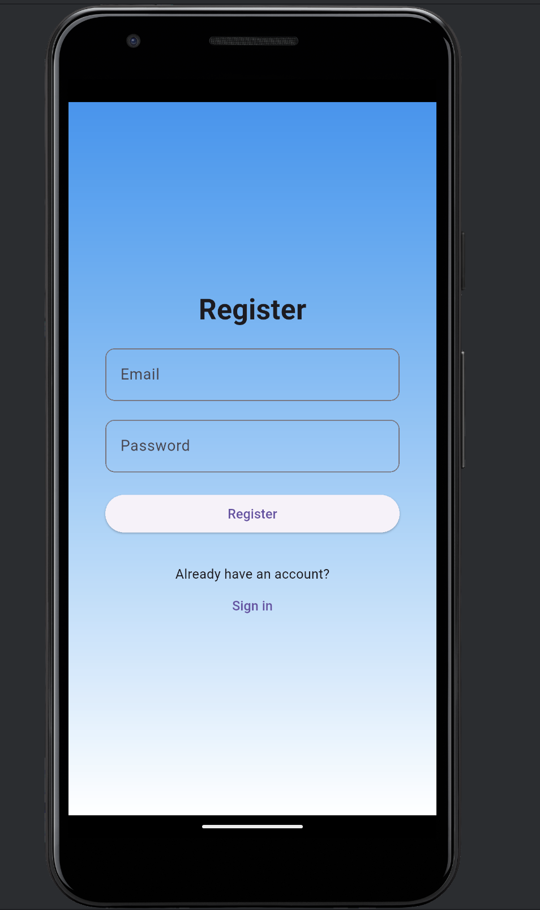
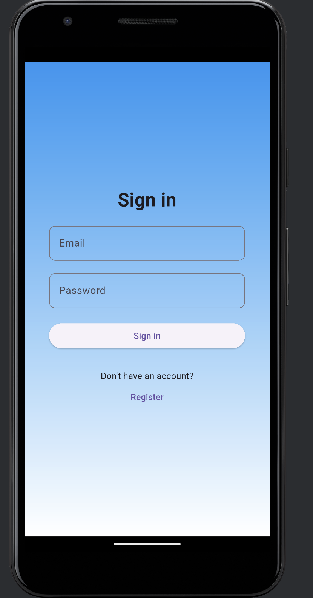
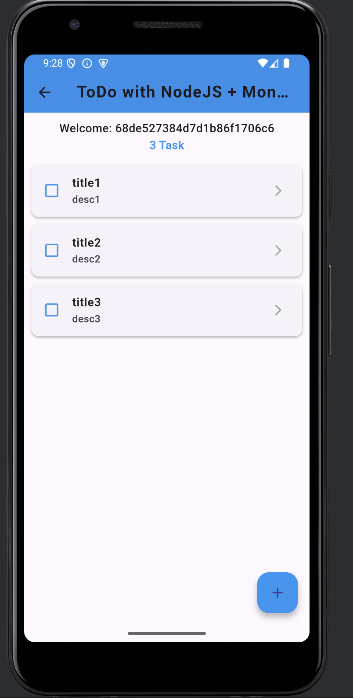

# Flutter ToDo App (Node.js + MongoDB)
A simple full-stack **ToDo App** built with **Flutter (Frontend)** and **Node.js + MongoDB (Backend)**.  
Users can register, log in, and manage their personal to-do tasks using secure **JWT authentication**.
---

## Features
- User Registration & Login (JWT Authentication)  
- Add ToDo with title & description  
- View all ToDo tasks in Dashboard  
- Delete tasks permanently from database  
- Fully functional REST API tested in Postman
---
## Tech Stack
**Frontend:** Flutter, Dart, SharedPreferences, HTTP, JWT Decoder  
**Backend:** Node.js, Express.js, MongoDB, Mongoose, Bcrypt, JWT  

---
## App Screenshots
| Login | Signup | Dashboard |
|-------|---------|-----------|
|  |  |  |

## Learning Outcomes

- Understood Flutter → Node.js → MongoDB integration  
- Implemented JWT authentication  
- Created & consumed REST APIs  
- Improved Flutter frontend & backend skills  
---
## Author

**Amna Liaqat**  
📧 amnaliaqatali27@gmail.com
🌐 github.com/Amna-Liaqat-Ali
